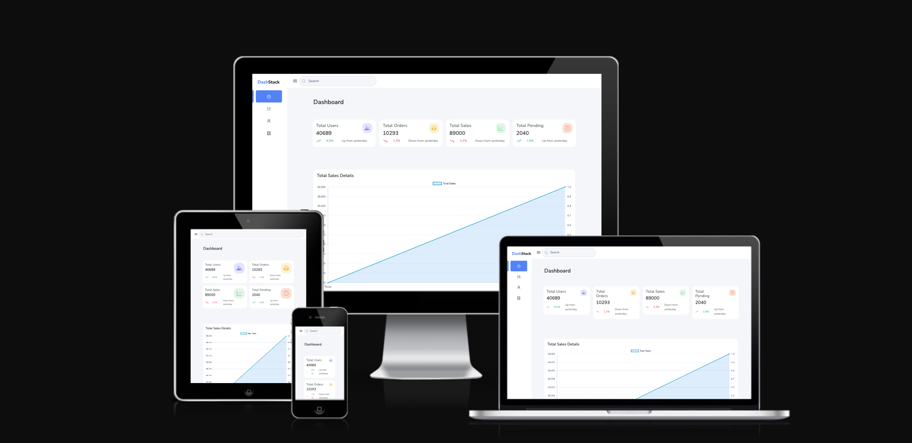

# Angular Dashboard App

A responsive dashboard web application built with **Angular**, **Angular Material** and **PrimeNG**.

This project includes a collapsible sidebar, filterable,searchable and responsive design for mobile and desktop.

## ScreenShots



## Features

- Sidebar navigation (expand/collapse)
- Filtration with dropdown and search
- Sorting capabilities for data columns (ascending/descending)
- Drill-down functionality to explore deeper details
- Responsive layout
- Data visualization using charts

---

## Tech Stack

- [Angular V20](https://angular.io/)
- [Angular Material](https://material.angular.io/)
- [PrimeNG](https://primeng.org/)
- [Bootstrap 5](https://getbootstrap.com/docs/5.3/getting-started/introduction/)

---

## Links

- Live Site URL: [Dashboard app](https://dash-stack-dashboard.netlify.app/)

## Installation

```bash
git clone https://github.com/saraz28/dashboard-app.git
cd dashboard-app
npm install
```
